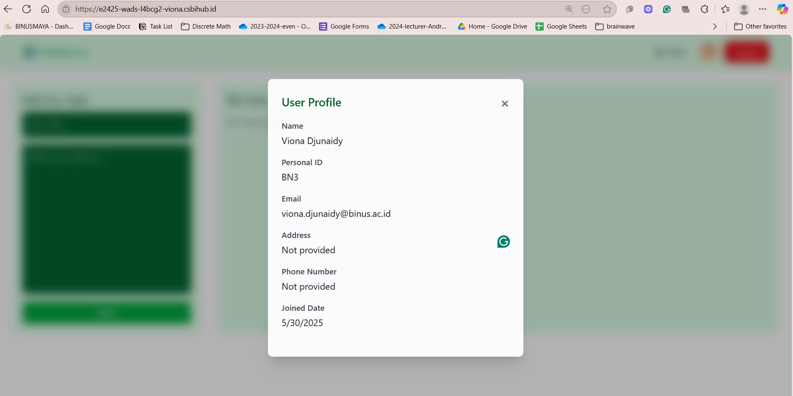
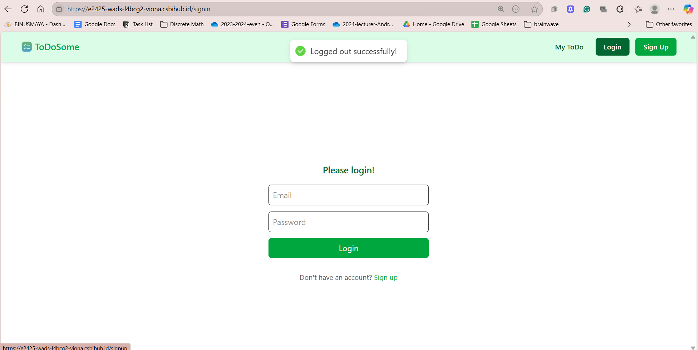

# Viona-Djunaidy_2702337602_L4BC_WADS-LAB_Week12

This document provides detailed information about the creation of the logout endpoint, integration between frontend and backend using axios and Redux Toolkit, implementation of features from the /user-info endpoint, as well as CI/CD pipeline using docker and github actions.
The web app can be accessed through this link: https://e2425-wads-l4bcg2-viona.csbihub.id

### 1. Log Out Endpoint
- **Endpoint**: `POST /api/users/logout`
- **Signin Example**:
  
- **Authorization using token Example**:
  
- **Logout Example**:
  
### 2. Sign Up UI
  
### 3. OTP E-mail
  
### 4. OTP Input
  
### 5. Log In UI
  
### 6. Viewing user-infor UI
  
### 7. Creating Todo UI
  
### 8. Todo created and saved UI
  
### 9. Editing a Todo UI
  
### 10. Edited Todo Saved UI
  
### 11. Deleting a Todo UI
  
### 12. User Info
  
### 13. Logging Out UI
  
